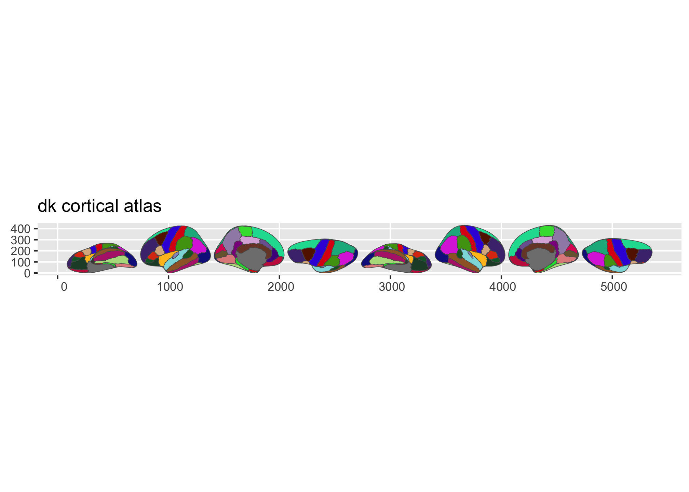
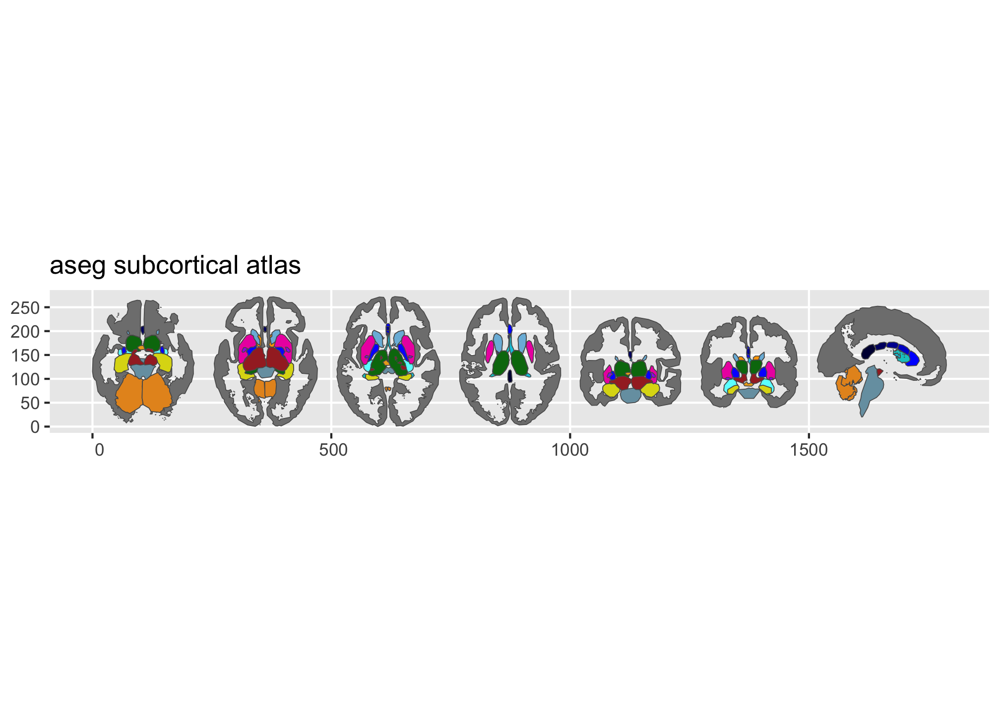
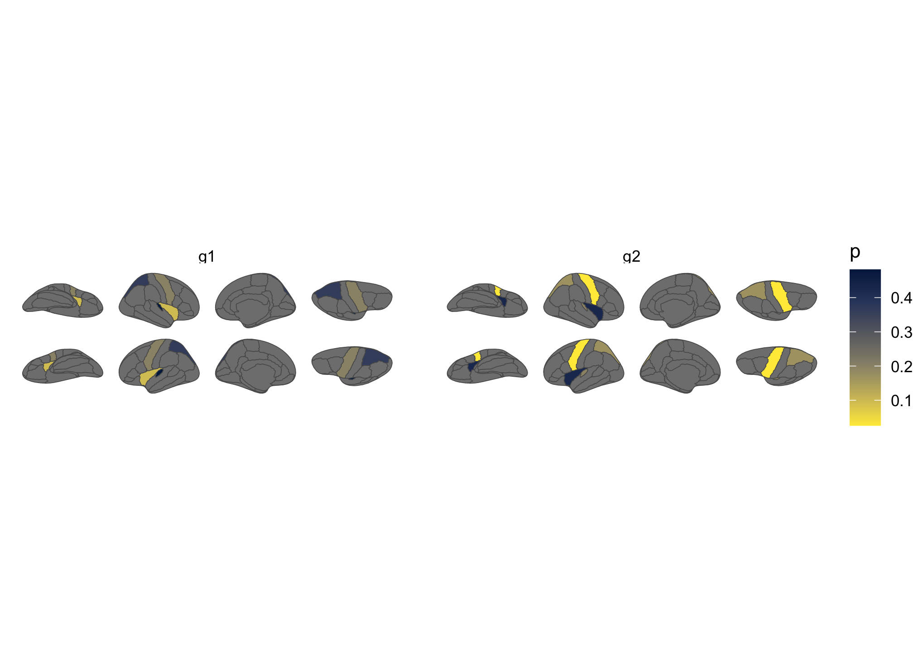

# ggseg

Neuroimaging analyses produce region-level results – cortical thickness,
p-values, network assignments – that need to end up on a brain figure.
ggseg stores brain atlas geometries as simple features and plots them as
ggplot2 layers, so you get publication-ready brain figures with the same
code you’d use for any other ggplot.

Mowinckel & Vidal-Piñeiro (2020). [*Visualization of Brain Statistics
With R Packages ggseg and
ggseg3d.*](https://doi.org/10.1177/2515245920928009) Advances in Methods
and Practices in Psychological Science.

## Installation

Install from CRAN:

``` r

install.packages("ggseg")
```

Or get the development version from the [ggsegverse
r-universe](https://ggsegverse.r-universe.dev):

``` r

options(repos = c(
  ggsegverse = "https://ggsegverse.r-universe.dev",
  CRAN = "https://cloud.r-project.org"
))
install.packages("ggseg")
```

## Quick start

``` r

library(ggseg)
library(ggplot2)
```

### Built-in atlases

ggseg ships with three atlases: `dk` (Desikan-Killiany cortical
parcellation), `aseg` (automatic subcortical segmentation), and
`tracula` (white matter tracts).
[`plot()`](https://rdrr.io/r/graphics/plot.default.html) gives you a
quick overview:

``` r

plot(dk())
plot(aseg())
```



Figure 1: Overview of the dk and aseg built-in brain atlases.



Figure 2: Overview of the dk and aseg built-in brain atlases.

### Plotting your own data

Pass a data frame to
[`ggplot()`](https://ggplot2.tidyverse.org/reference/ggplot.html) with a
column that matches the atlas (typically `region` or `label`).
[`geom_brain()`](https://ggsegverse.github.io/ggseg/reference/ggbrain.md)
handles the join:

``` r

library(dplyr)

some_data <- tibble(
  region = rep(
    c(
      "transverse temporal",
      "insula",
      "precentral",
      "superior parietal"
    ),
    2
  ),
  p = sample(seq(0, .5, .001), 8),
  groups = c(rep("g1", 4), rep("g2", 4))
)

ggplot(some_data) +
  geom_brain(
    atlas = dk(),
    position = position_brain(hemi ~ view),
    aes(fill = p)
  ) +
  facet_wrap(~groups) +
  scale_fill_viridis_c(option = "cividis", direction = -1) +
  theme_void()
```



Figure 3: Brain plot coloured by external data, faceted by group.

## More atlases

Many additional atlases are available through the [ggsegverse
r-universe](https://ggsegverse.r-universe.dev):

``` r

install.packages("ggsegYeo2011", repos = "https://ggsegverse.r-universe.dev")
```

## Learn more

The [package website](https://ggsegverse.github.io/ggseg/) has vignettes
covering external data, view positioning, the
[`geom_sf()`](https://ggplot2.tidyverse.org/reference/ggsf.html)
workflow, and reading FreeSurfer stats files.

## Funding

This tool is partly funded by:

**EU Horizon 2020 Grant:** Healthy minds 0-100 years: Optimising the use
of European brain imaging cohorts (Lifebrain). Grant agreement number:
732592.
